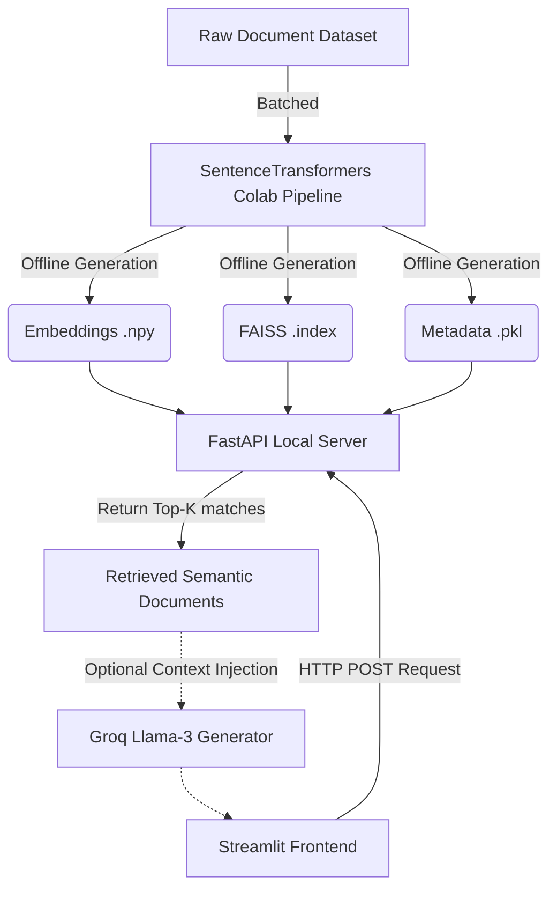

# Embedding-Based Semantic Search System (RAG)

A production-ready Semantic Search engine that converts massive local document datasets into rapidly searchable vector representations (Embeddings) using FAISS. The system completely decouples the heavy indexing process from the serving layer, achieving high scalability with zero GPU dependencies.

## 🌟 Features
* **Lightning-Fast Vector Search:** Index up to millions of texts using exact L2-distance FAISS search, fetching matches in < 100 milliseconds locally.
* **GPU-Free Local Inference:** Utilizes `all-MiniLM-L6-v2`, an incredibly lightweight mathematical embedding model optimized for CPU inference without bottlenecking.
* **Retrieval-Augmented Generation (RAG):** Includes an integrated Groq API adapter capable of taking raw fetched documents and passing them dynamically into a Llama-3 LLM to synthesize cited natural-language answers.
* **Beautiful User Interface:** A stunning Streamlit modern frontend tailored for a high-end, premium user experience.

## 🏗️ Architecture Design



## 🚀 Setup & Execution

### 1. Vector Pipeline (Offline Loading Layer)
We intentionally offload the processing to a free Google Colab instance so laptops don't freeze over large scale datasets.
1. Read `colab/COLAB_INSTRUCTIONS.md` and run the blocks in Colab.
2. Download the resulting `faiss.index`, `embeddings.npy`, and `metadata.pkl`.
3. Drop them strictly into the `models/` directory in this engine.

### 2. Start the Backend API (FastAPI)
The backend loads the entire vector database into RAM.
```bash
cd backend/
pip install -r requirements.txt
python -m uvicorn main:app --host 0.0.0.0 --port 8000
```
*(Optional RAG)*: Before launching, set your API key environment variable in Powershell:
`$env:GROQ_API_KEY="gsk_..."`

### 3. Launch the Search Engine UI (Streamlit)
```bash
cd frontend/
pip install -r requirements.txt
python -m streamlit run app.py
```

## 🛠️ Technology Stack
* **Vector DB Engine:** FAISS (`IndexFlatL2`)
* **Embedding Model:** 🤗 `sentence-transformers/all-MiniLM-L6-v2`
* **API Framework:** FastAPI, Uvicorn & Pydantic
* **Frontend:** Streamlit with Custom CSS injection
* **RAG LLM Engine:** Groq API (Llama-3 Architecture)
